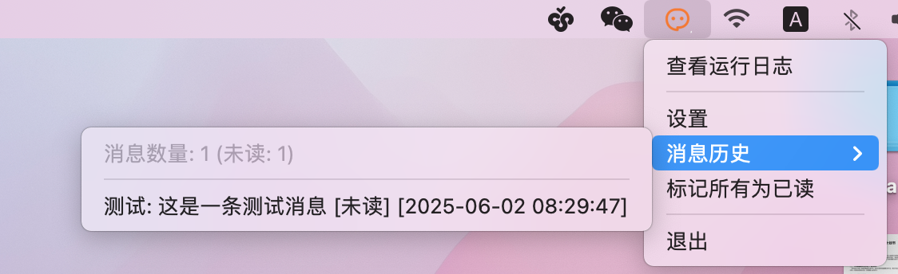
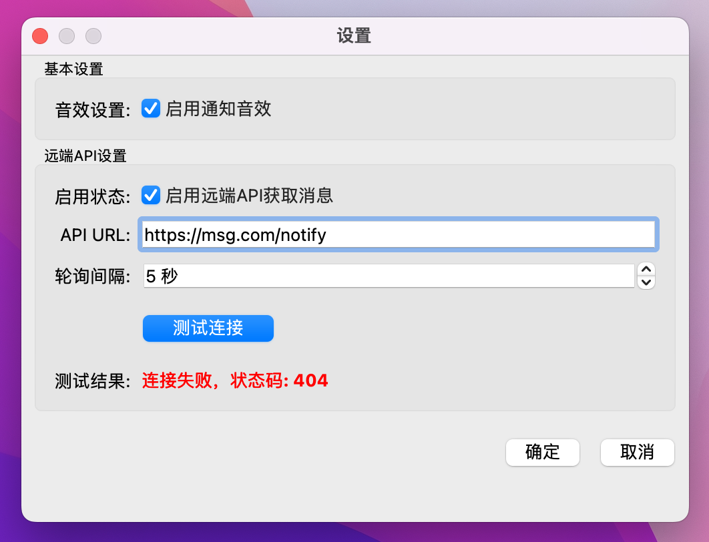
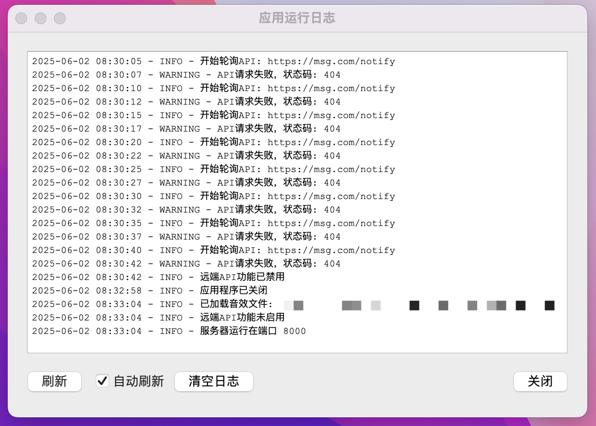

# 桌面端状态通知 - Pi App





## 背景

当你在桌面端执行长时间后台任务，却不想时刻紧盯进程时，Pi APP 正是你的理想之选。你只需在任务结束的瞬间，向 Pi APP 发送一个 HTTP 请求，它便能立即以桌面弹窗、音效等多种方式，第一时间告知开发者任务已顺利完成，让你不再为等待任务结果而时刻紧绷神经。

## 开发环境准备

```sh
# 初始化开发环境
$ python3 -m venv ~/.pyenvs/py3 && \
    source ~/.pyenvs/py3/bin/activate && \
    pip install pyside6

# 运行app
$ git clone https://gitee.com/im623/notify_ui.git && \
    cd notify_ui && \
    python pi_app.py
```

## 远端API应返回的JSON格式样例

```json
{
  "notifications": [
    {
      "title": "任务通知",
      "message": "后台任务A已执行完成",
      "timestamp": "2023-05-01 10:00:00"
    }
  ]
}
```

## 测试

```sh
$ curl -X POST -H 'Content-Type: application/json' \
    -d '{"title":"测试","message":"这是一条测试消息"}' \
    http://localhost:8000
```
