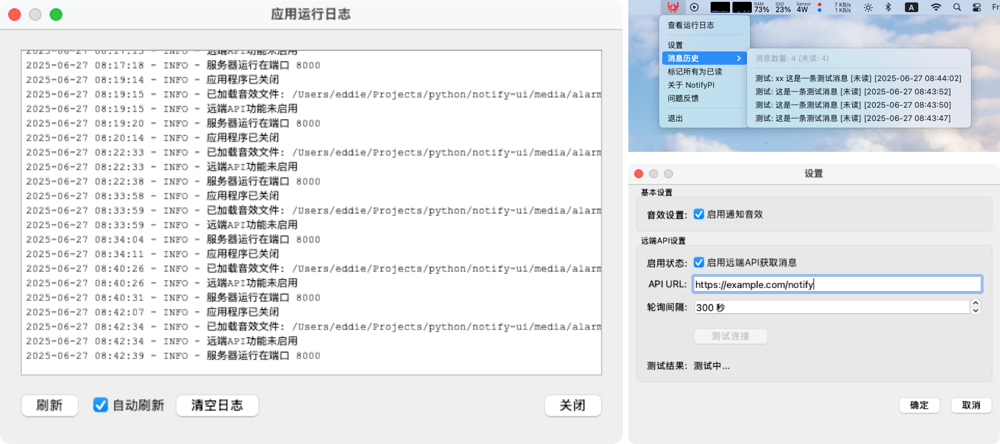

# 桌面端状态通知App - NotifyPi




Pi APP：任务跑完立马喊你，再也不用干等着！

你是不是也遇到过这种情况——电脑跑着耗时任务，时不时就得瞅一眼进度，生怕错过完成时刻？

用 Pi APP，任务结束第一时间提醒你！

✅ 桌面弹窗 + 提示音——任务完成瞬间，立刻弹出通知，还有“哞哞”提示音，想忽略都难！<br>
✅ 远程任务也能管——服务器上的任务跑完了？配置好 Pi APP，它自动帮你盯着，不用再反复登录检查。<br>
✅ 解放双手和眼睛——该摸鱼摸鱼，该干活干活，任务结束 Pi APP 自然会叫你，再也不用守着进度条发呆！<br>

适用场景：

* 代码编译/测试跑完了？——Pi APP 喊你来看结果！
* 数据处理/模型训练结束？——不用再反复刷新，通知直接弹脸上！
* 任何需要长时间等待的任务——挂上去，该干嘛干嘛，结束立马知道！


## 开发环境准备

```sh
# 初始化开发环境
$ python3 -m venv ~/.pyenvs/py3 && \
    source ~/.pyenvs/py3/bin/activate

# 运行app
$ git clone https://gitee.com/im623/notify_ui.git && \
    cd notify_ui && \
    pip install -r requirements.txt && \
    python pi_app.py
```

## 远端API应返回的JSON格式样例

```json
{
  "notifications": [
    {
      "title": "任务通知",
      "message": "后台任务A已执行完成",
      "timestamp": "2023-05-01 10:00:00"
    }
  ]
}
```

## 本地消息测试发送

```sh
$ curl -X POST -H 'Content-Type: application/json' \
    -d '{"title":"测试","message":"这是一条测试消息"}' \
    http://localhost:8000
```
